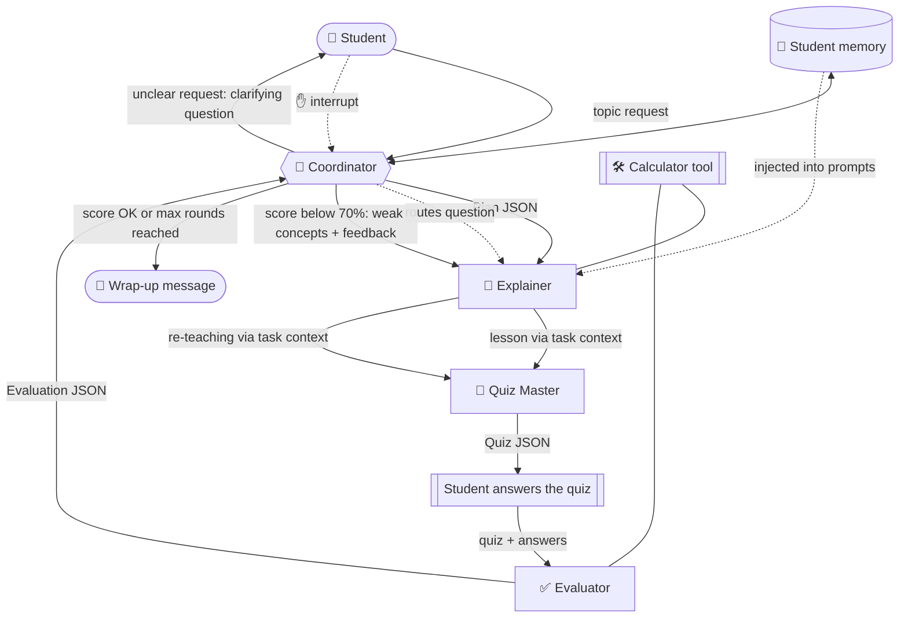
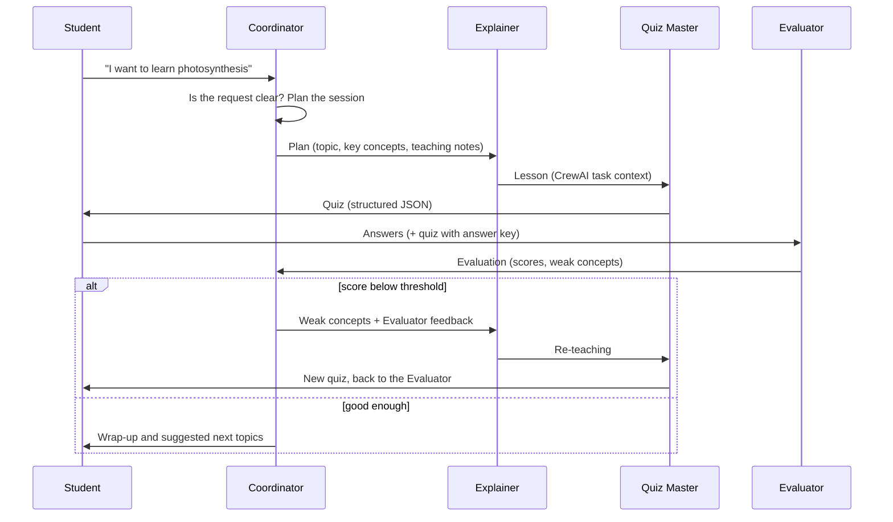

# 🎓 Leo - Multi-Agent AI Tutor

Leo is an AI study assistant made of **four specialised agents that collaborate** to teach you any topic.
You choose what you want to learn, and Leo's agents plan the session, explain the concept, quiz you, grade your answers
and, if you struggle, teach the weak parts again.

Built with [CrewAI](https://github.com/crewAIInc/crewAI), Google Gemini, Pydantic and Gradio.

## ✨ Features

- **Four agents, one team**: Coordinator, Explainer, Quiz Master and Evaluator, each with its own role, prompt and behaviour.
- **Real handoffs**: each agent's output becomes the next agent's input (plan → lesson → quiz → evaluation → re-teaching).
- **Structured outputs**: quizzes and evaluations are validated JSON (Pydantic), not free text.
- **Adaptive feedback loop**: if your score is low, the weak concepts go back to the Explainer for a new explanation and a fresh quiz.
- **Human in the loop**: interrupt Leo at any time to ask a question or request a simpler explanation.
- **Memory**: Leo remembers your name, past topics, scores and weak concepts between sessions.
- **Handles problems gracefully**: unclear requests get a clarifying question; stalled or failing agents are retried automatically.
- **Live agent activity panel**: see which agent is working and when work is handed over.
- **Two interfaces**: web UI (Gradio) and command line.

## 👥 The agents

| Agent | What it does | Output |
|-------|--------------|--------|
| 🧭 **Coordinator** | Reads your request, asks a clarifying question if it is vague, plans the session, delegates to the others, recovers from failures and writes the final wrap-up | Session plan (JSON), wrap-up message |
| 📖 **Explainer** | Teaches the topic with analogies and a worked example; re-teaches weak concepts; answers your interruptions | Markdown lesson |
| 📝 **Quiz Master** | Creates practice questions based on the lesson | Quiz (structured JSON) |
| ✅ **Evaluator** | Grades your answers with partial credit, explains mistakes and detects weak concepts | Evaluation (structured JSON) |

Each agent's persona and task prompts live in [`leo/prompts.py`](leo/prompts.py).

## 🏗️ Architecture



### One session, step by step



## 🧭 How the orchestration works

Leo uses a **sequential orchestration pattern managed by the Coordinator** (CrewAI `Process.sequential`).
Each phase of a session is a sequential crew:

1. **Triage**: the Coordinator checks the request and produces a plan (or asks you to clarify).
2. **Teach + quiz**: the Explainer writes the lesson, which is passed to the Quiz Master through CrewAI task `context`.
3. **Evaluate**: the quiz (with answer key) and your answers are handed to the Evaluator.
4. **Re-teach (if needed)**: the Evaluator's feedback goes back to the Explainer, then a new quiz is generated. This repeats up to a maximum number of rounds.
5. **Wrap-up**: the Coordinator summarises your progress and suggests what to study next.

The pipeline pauses between phases to wait for you, so you stay in control.

### Error handling
- **Unclear or empty request** → the Coordinator asks a clarifying question (up to 2 times, then it picks a sensible focused topic).
- **Agent stalls or fails** → agents have time and iteration limits, and the Coordinator retries the step with back-off.
- **Malformed JSON** → outputs are parsed tolerantly, validated with Pydantic and retried if invalid.
- **Everything fails** → a friendly error message is shown and the app keeps running.
- **Blank answers** → the Coordinator asks you to try before involving the Evaluator.

### Memory
- **Persistent memory** (`leo_memory.json`, created automatically): name, level, topics studied, best/last scores and weak concepts. It is injected into the prompts, so a returning student gets a lesson that takes their history into account.
- **Session memory**: the current plan, lesson, quiz and evaluations for each round.

### Tools
A safe **Calculator** tool (arithmetic parsed with Python's `ast`, no `eval`) is available to the Explainer and the Evaluator.
Disable it with `LEO_USE_TOOLS=false`.

## 🚀 Getting started

### Requirements
- Python 3.10 - 3.12
- A free Gemini API key from [Google AI Studio](https://aistudio.google.com/apikey)

### Installation
```bash
git clone https://github.com/YOUR_USERNAME/leo-ai-tutor.git
cd leo-ai-tutor

python -m venv .venv
source .venv/bin/activate        # Windows: .venv\Scripts\activate

pip install -r requirements.txt
```

### Configure your API key
Copy the example environment file and add your key:
```bash
cp .env.example .env             # Windows: copy .env.example .env
```
Then edit `.env`:
```
GEMINI_API_KEY=your_api_key_here
```
The `.env` file is git-ignored, so your key is never uploaded.

### Run the web app
```bash
python app.py
```
Open <http://127.0.0.1:7860> in your browser.

### Run the command-line version
```bash
python cli.py
```
In the CLI, type `/ask <your question>` at any answer prompt to interrupt Leo, or `/quit` to exit.

## 🖥️ Using the web app

1. Enter your **name** and **level**, then type a **topic** (for example `how a for loop works in Python`).
2. Click **🚀 Start / Reply to Leo**. Watch the **Live agent activity** panel on the right to see each agent's turn and handoff.
3. If the topic is too broad (for example `science`), Leo asks a clarifying question. Type a more specific answer in the same topic box and click the button again.
4. Read the lesson, then answer the quiz questions and click **✅ Submit answers to the Evaluator**.
5. Read the feedback. If your score is below 70%, Leo re-teaches the weak concepts and gives you a new quiz.
6. At any moment, open **✋ Interrupt Leo** to ask a question or request a simpler explanation.
7. When the session ends, you get a wrap-up with your progress and suggested next topics.

**Topic ideas:** the Pythagorean theorem · Newton's laws of motion · the water cycle · how vaccines work ·
supply and demand · fractions · variables in programming.

## ⚙️ Configuration

All settings are environment variables (put them in `.env`).

| Variable | Default | Description |
|----------|---------|-------------|
| `GEMINI_API_KEY` | - | Your Gemini API key (required) |
| `LEO_MODEL` | `gemini/gemini-3.5-flash-lite` | Model used by all agents |
| `LEO_N_QUESTIONS` | `3` | Questions per quiz (1-5) |
| `LEO_MAX_ROUNDS` | `3` | Maximum quiz rounds (re-teaching limit) |
| `LEO_PASS_SCORE` | `0.7` | Scores below this trigger re-teaching |
| `LEO_MAX_RETRIES` | `3` | Retries per step when an agent fails |
| `LEO_AGENT_TIMEOUT` | `120` | Seconds before an agent counts as stalled |
| `LEO_USE_TOOLS` | `true` | Enable the calculator tool |
| `LEO_VERBOSE` | `false` | Print detailed CrewAI logs |
| `LEO_MEMORY_PATH` | `leo_memory.json` | Where student memory is stored |

### Choosing a different model
Leo uses Gemini through CrewAI's `LLM` class. To use another Gemini model, set its id in `.env`:
```
LEO_MODEL=gemini/gemini-2.5-flash-lite
```

## 🧪 Testing without an API key
A test runs the complete flow (clarification, handoffs, interruption, feedback loop, memory) with a fake LLM:
```bash
python tests/test_flow_mock.py
```
It prints `ALL OK` on success.

## ☁️ Running in a notebook (optional)
[`notebooks/leo_kaggle.ipynb`](notebooks/leo_kaggle.ipynb) runs Leo in Kaggle or similar notebook environments.
Enable internet access, store your key as a secret named `GEMINI_API_KEY`, and run the cells to get a shareable Gradio link.

## 📁 Project structure
```
leo-ai-tutor/
├── app.py                  # Gradio web interface with live agent activity
├── cli.py                  # Command-line interface
├── leo/
│   ├── agents.py           # The four CrewAI agents
│   ├── prompts.py          # Role personas and task prompt templates
│   ├── orchestrator.py     # Coordinator logic, handoffs, retries, feedback loop
│   ├── schemas.py          # Pydantic models for structured outputs
│   ├── memory.py           # Persistent student memory
│   ├── tools.py            # Calculator tool
│   ├── events.py           # Agent activity log
│   └── config.py           # Settings and API key loading
├── notebooks/
│   └── leo_kaggle.ipynb    # Optional notebook runner
├── tests/
│   └── test_flow_mock.py   # Offline end-to-end test
├── requirements.txt
└── .env.example            # Template for your API key (no real keys)
```

## 🛠️ Troubleshooting

| Problem | Fix |
|---------|-----|
| `model not found` / 404 error | Set `LEO_MODEL` to a model id your API key can access |
| `No API key found` | Make sure `.env` exists in the project root and contains `GEMINI_API_KEY` |
| 429 rate-limit errors | Leo retries automatically; wait a minute or lower `LEO_N_QUESTIONS` |
| `pip install` fails | Use Python 3.10 - 3.12 inside a fresh virtual environment |
| Page does not load | Check that `python app.py` is still running and port 7860 is free |


